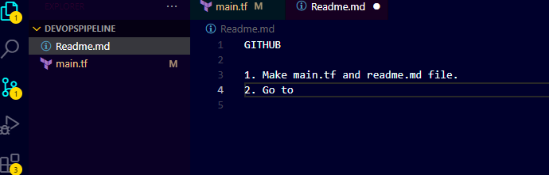

A. Preparing GITHUB Repo :

    1. Make "main.tf" and "readme.md" file.
    2. Go to "Source Control" icon in VS Code.
                
    3. Go to "Initilize Repo" > "Publish to GitHub"
    4. Name your repo and click "Commit".

B. Populate Terraform :

    1. Make .tf files such that :
        1.1 azureprovider.tf - Contains Provider details.
        1.2 main.tf - Contains all of infra creation script and Res Group andStorage account as Data Sources.
        1.3 vars.tf - Contains variaples (I/P & O/P).
    2. Populate your files with code.
    3. Initilise Azure in VS Code by typing in terminal : "az init".
    4. Fill your details and confirm login.

C. Running Terraform :

    1. In VS Code Terminal, run "$terraform init" - Installs Azure modules and backends(Storage account and container) to store state file(Ensures Security). You'll see the message below :

            PS D:\DevOpsPipeline> terraform init
            Initializing the backend...
            Successfully configured the backend "azurerm"! Terraform will automatically
            use this backend unless the backend configuration changes.
            Initializing provider plugins...
            - Finding latest version of hashicorp/azurerm...
            - Installing hashicorp/azurerm v3.75.0...
            - Installed hashicorp/azurerm v3.75.0 (signed by HashiCorp)
            Terraform has created a lock file .terraform.lock.hcl to record the provider
            selections it made above. Include this file in your version control repository
            so that Terraform can guarantee to make the same selections by default when
            you run "terraform init" in the future.
            Terraform has been successfully initialized!
            You may now begin working with Terraform. Try running "terraform plan" to see
            any changes that are required for your infrastructure. All Terraform commands
            should now work.
            If you ever set or change modules or backend configuration for Terraform,
            rerun this command to reinitialize your working directory. If you forget, other
            commands will detect it and remind you to do so if necessary.

    2. Now run "$terraform validate" to check if there's any syntax errors in your code.

            OutPut = 
            Success! The configuration is valid, but there were some validation warnings as shown above.

    3. Now it's time to see our planned infra (as a plan sheet) and what resources will be made using "$terraform plan". You can also save your plan using "--out = "filename"" flag with this command.
           
            Output = 
            PS D:\DevOpsPipeline> terraform plan
            Acquiring state lock. This may take a few moments...
            var.pwd
            Enter Password for [Azure SqL Server] and [Airflow VM]
            Enter a value: Mypassword123
            data.azurerm_resource_group.az_rg: Reading...
            data.azurerm_resource_group.az_rg: Read complete after 0s [id=/subscriptions/524f77db-2d08-4249-b27d-96ea3960d824/resourceGroups/pipelineResGrp]
            data.azurerm_storage_account.az_sa: Reading...
            data.azurerm_storage_account.az_sa: Read complete after 3s [id=/subscriptions/524f77db-2d08-4249-b27d-96ea3960d824/resourceGroups/pipelineResGrp/providers/Microsoft.Storage/storageAccounts/my1str2ac]
            data.azurerm_storage_container.az_sa_c: Reading...
            data.azurerm_storage_container.az_sa_c: Read complete after 3s [id=https://my1str2ac.blob.core.windows.net/mycontainer]
            Terraform used the selected providers to generate the following execution plan. Resource actions are indicated with the following symbols:
            + create
            Terraform will perform the following actions:
            # azurerm_data_factory.az_data_factory will be created
            + resource "azurerm_data_factory" "az_data_factory" {
                + id                     = (known after apply)
                + location               = "eastus"
                + name                   = "my-data-factory"
                + public_network_enabled = true
                + resource_group_name    = "pipelineResGrp"
                }
            # azurerm_mssql_server.az_sql_server will be created
            + resource "azurerm_mssql_server" "az_sql_server" {
                + administrator_login                  = "shouryasood"
                + administrator_login_password         = (sensitive value)
                + connection_policy                    = "Default"
                + fully_qualified_domain_name          = (known after apply)
                + id                                   = (known after apply)
                + location                             = "eastus"
                + minimum_tls_version                  = "1.2"
                + name                                 = "my-sql-server"
                + outbound_network_restriction_enabled = false
                + primary_user_assigned_identity_id    = (known after apply)
                + public_network_access_enabled        = true
                + resource_group_name                  = "pipelineResGrp"
                + restorable_dropped_database_ids      = (known after apply)
                + version                              = "12.0"
                }
            # azurerm_network_interface.az_nic will be created
            + resource "azurerm_network_interface" "az_nic" {
                + applied_dns_servers           = (known after apply)
                + dns_servers                   = (known after apply)
                + enable_accelerated_networking = false
                + enable_ip_forwarding          = false
                + id                            = (known after apply)
                + internal_dns_name_label       = (known after apply)
                + internal_domain_name_suffix   = (known after apply)
                + location                      = "eastus"
                + mac_address                   = (known after apply)
                + name                          = "my-network-interface"
                + private_ip_address            = (known after apply)
                + private_ip_addresses          = (known after apply)
                + resource_group_name           = "pipelineResGrp"
                + virtual_machine_id            = (known after apply)
                + ip_configuration {
                    + gateway_load_balancer_frontend_ip_configuration_id = (known after apply)
                    + name                                               = "ipconfig1"
                    + primary                                            = (known after apply)
                    + private_ip_address                                 = (known after apply)
                    + private_ip_address_allocation                      = "Dynamic"
                    + private_ip_address_version                         = "IPv4"
                    + subnet_id                                          = (known after apply)
                    }
                }
            # azurerm_sql_database.az_sql_db will be created
            + resource "azurerm_sql_database" "az_sql_db" {
                + collation                        = "SQL_Latin1_General_CP1_CI_AS"
                + create_mode                      = "Default"
                + creation_date                    = (known after apply)
                + default_secondary_location       = (known after apply)
                + edition                          = "Standard"
                + elastic_pool_name                = (known after apply)
                + encryption                       = (known after apply)
                + id                               = (known after apply)
                + location                         = "eastus"
                + max_size_bytes                   = (known after apply)
                + max_size_gb                      = (known after apply)
                + name                             = "my-sql-db"
                + read_scale                       = false
                + requested_service_objective_id   = (known after apply)
                + requested_service_objective_name = (known after apply)
                + resource_group_name              = "pipelineResGrp"
                + restore_point_in_time            = (known after apply)
                + server_name                      = "my-sql-server"
                + source_database_deletion_date    = (known after apply)
                + source_database_id               = (known after apply)
                + threat_detection_policy {
                    + disabled_alerts            = (known after apply)
                    + email_account_admins       = (known after apply)
                    + email_addresses            = (known after apply)
                    + retention_days             = (known after apply)
                    + state                      = (known after apply)
                    + storage_account_access_key = (sensitive value)
                    + storage_endpoint           = (known after apply)
                    }
                }
            # azurerm_subnet.example will be created
            + resource "azurerm_subnet" "example" {
                + address_prefixes                               = [
                    + "10.0.1.0/24",
                    ]
                + enforce_private_link_endpoint_network_policies = (known after apply)
                + enforce_private_link_service_network_policies  = (known after apply)
                + id                                             = (known after apply)
                + name                                           = "example-subnet"
                + private_endpoint_network_policies_enabled      = (known after apply)
                + private_link_service_network_policies_enabled  = (known after apply)
                + resource_group_name                            = "pipelineResGrp"
                + virtual_network_name                           = "example-vnet"
                }
            # azurerm_virtual_machine.az_vm will be created
            + resource "azurerm_virtual_machine" "az_vm" {
                + availability_set_id              = (known after apply)
                + delete_data_disks_on_termination = false
                + delete_os_disk_on_termination    = false
                + id                               = (known after apply)
                + license_type                     = (known after apply)
                + location                         = "eastus"
                + name                             = "my-airflow-vm"
                + network_interface_ids            = (known after apply)
                + resource_group_name              = "pipelineResGrp"
                + vm_size                          = "Standard_DS2_v2"
                + identity {
                    + identity_ids = (known after apply)
                    + principal_id = (known after apply)
                    + type         = (known after apply)
                    }
                + storage_data_disk {
                    + caching                   = (known after apply)
                    + create_option             = (known after apply)
                    + disk_size_gb              = (known after apply)
                    + lun                       = (known after apply)
                    + managed_disk_id           = (known after apply)
                    + managed_disk_type         = (known after apply)
                    + name                      = (known after apply)
                    + vhd_uri                   = (known after apply)
                    + write_accelerator_enabled = (known after apply)
                    }
                + storage_image_reference {
                    + id        = (known after apply)
                    + offer     = (known after apply)
                    + publisher = (known after apply)
                    + sku       = (known after apply)
                    + version   = (known after apply)
                    }
                + storage_os_disk {
                    + caching                   = "ReadWrite"
                    + create_option             = "FromImage"
                    + disk_size_gb              = (known after apply)
                    + managed_disk_id           = (known after apply)
                    + managed_disk_type         = "Standard_LRS"
                    + name                      = "osdisk"
                    + os_type                   = (known after apply)
                    + write_accelerator_enabled = false
                    }
                }
            # azurerm_virtual_network.azvitnet will be created
            + resource "azurerm_virtual_network" "azvitnet" {
                + address_space       = [
                    + "10.0.0.0/16",
                    ]
                + dns_servers         = (known after apply)
                + guid                = (known after apply)
                + id                  = (known after apply)
                + location            = "eastus"
                + name                = "example-vnet"
                + resource_group_name = "pipelineResGrp"
                + subnet              = (known after apply)
                }
            Plan: 7 to add, 0 to change, 0 to destroy.
            Note: You didn't use the -out option to save this plan, so Terraform can't guarantee to take exactly these actions if you run "terraform apply" now.     
            Releasing state lock. This may take a few moments...

    4. Now register your provider for Azure Data Factory :
        "az provider register --namespace Microsoft.DataFactory"

    5. Now after confirming our resources to be made we can run "$terraform apply" to create our infrastructure in AZURE Cloud Platform. Type "yes" when prompted or use "--auto-approve" flag with this command. ( Deploying "Azure MsSQL Server" might take some time; around 25 to 30 minutes ).

    6. You can check your resources using "$terraform state list" command, helpful in TAINTING, REMOVING or UPDATING a particular resource.

D. Implementing Github Actions to automate pipeline.

    1. Create a [.github/workflows] directory in your repository if it doesn't already exist.
    2. Inside the [.github/workflows] directory, create a YAML file (In My Case : terraform-apply.yml) 
                [ Make sure to store your secret in GITHUB ACTIONS > Settings > Secrets > New Secret ]
    3. Commit and push the [.github/workflows/terraform-apply.yml] file to your main branch in your GitHub repository.
    4. GitHub Actions will automatically detect the new workflow and start running it when you push changes to the main branch.